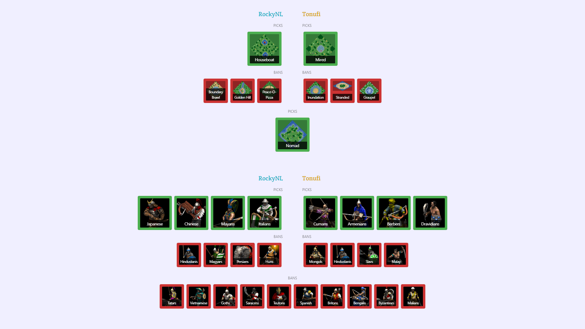

# Age of Empires 2 - Streaming Utilities

This repository contains various things that are useful if you want to stream Age of Empires 2 matches.

- [Streaming Overlay for Map and Civ Drafts](#streaming-overlay-for-map-and-civ-drafts)
- [AoE2 Replay File Type Association](#aoe2-replay-file-type-association)

## Streaming Overlay for Map and Civ Drafts

When casting Age of Empires 2 tournament games, it is usually nice to be able to show the map and civ drafts from [aoe2cm.net](https://aoe2cm.net).
This repository contains some settings and preset to allow you to easily fit both the map and civ drafts in one scene with all the clutter removed.
The way it works is that you have two browser source elements, one for the map draft and one for the civ draft.
Then you apply some custom CSS to both of them to remove some elements, make the background transparent and tighten the margins.
There are two ways to set this up: importing the pre-made scene collection or following the step-by-step guide to set it up yourself.

Note that this is just a base. You probably want to add a more interesting background, any channel graphics you use and maybe the logo of the tournament.

- [OBS Studio Instructions](#obs-studio-instructions)
- [XSplit Broadcaster Setup](#xsplit-broadcaster-setup)
- [Notes on Customization](#customization)

### Preview

This is what it can look like once you have set it up:



### OBS Studio Instructions

#### Import Setup

1. Download [aoe2cm-obs.json](aoe2cm-obs.json)
2. Go to OBS
3. Click "Scene collection" -> "Import"
4. Click the three dots
5. Select the "aoe2cm-obs.json" file and click "Open"
6. Check that the name column lists "AoE2" and the "Discovered Applications" column lists "OBS Studio"
7. Click "Import"

#### Manual Setup

1. Create a new source of type "Browser Source"
2. Go to the source settings
3. Enter the URL of the map draft as the URL
4. Set the width to the full width of your canvas (e.g. 1920)
5. Set the height to half of the height of your canvas (e.g. 1080/2 = 540)
6. Copy the contents of [aoe2cm-obs.css](aoe2cm-obs.css) into the "Custom CSS" box.
7. Click Ok
8. Repeat step 1-7 for the civ draft
9. Align the map draft with the top of your canvas
10. Align the civ draft with the bottom of your canvas
11. Click the lock icon on both sources to avoid accidental edits

#### Changing Drafts

To change the draft:

1. Double click map draft source
2. Change the URL to your new draft
3. Repeat step 1-2 for the civ draft

### XSplit Broadcaster Setup

#### Manual Setup

1. Click "Add Source" -> "Webpage"
2. Enter the map draft URL and click "Ok"
3. Right click the newly created source in the list and click "Settings"
4. Under "Display", select custom resolution
5. Set the width to the full width of your canvas (e.g. 1920)
6. Set the height to half of the height of your canvas (e.g. 1080/2 = 540)
7. Under "Custom Code", check the box for "Use Custom CSS"
8. Click "Edit CSS", paste the contents of [aoe2cm-obs.css](aoe2cm-obs.css) into the box and click "Apply"
9. Repeat step 1-8 for the civ draft
10. Align the map draft with the top of your canvas
11. Align the civ draft with the bottom of your canvas
12. Right click each source in the list and click "Lock Position" to avoid accidental edits

### Customization

I have tried structuring the CSS code so that it is clear what each section does.
If you know CSS you can tweak it to suit your needs. For example, by default the pick/ban order box is hidden as well as the map pool.
If you want to show either of them, simply comment out (with /* */) or remove the CSS section responsible for that.
If you want to modify the margins between the items, check out the padding/margin properties in that section.
You might also want to add back the background or border for the player boxes. Try it out and see what works best for you.

## AoE2 Replay File Type Association

In Windows you can associate file types with programs so that when you double-click a file of that type, a specific program opens. For example, a .jpg file might open in the Photos app. You might have noticed that if you try to do this with `.aoe2record` files by clicking "Open with..." and choose Capture Age, it doesn't quite work. It will open Capture Age but not load the replay.

If you open a Windows terminal and paste the following [snippet](aoe2record-association.ps1), the file type association will be set up properly so that when you double-click an `.aoe2record` file, Capture Age will start and load directly into the replay.

```
$Extension = ".aoe2record"
$ProgId = "CaptureAgeLocal"
$captureAgePath = "$env:LOCALAPPDATA\Programs\CaptureAge\CaptureAge.exe"
$progCommand = "`"$captureAgePath`" `"captureage://spectate?aoe2record=%1`""
$keyPath = "HKEY_CURRENT_USER\SOFTWARE\Classes\$Extension\OpenWithProgids"
[Microsoft.Win32.Registry]::SetValue( $keyPath, $ProgId, ([byte[]]@()), [Microsoft.Win32.RegistryValueKind]::None)
$keyPath = "HKEY_CURRENT_USER\SOFTWARE\Classes\$ProgId\Shell\Open\Command"
[Microsoft.Win32.Registry]::SetValue($keyPath, "", $progCommand)
```

### Technical explanation

By convention, normally the way you open a file with a program is that you provide the path as the first argument when launching the program, for example `word.exe C:\some\path\my-document.docx`. However, Capture Age is not programmed to support this. However, they have programmed support for a custom protocol handler which allows you to open a URL of the form `captureage://spectate?aoe2record=<path>`. This URL is then passed in full as the first argument to Capture Age which will open the replay. This means that we just need to set up the file-type association slightly differently. Instead of using the common format of `"C:\path\to\captureage.exe" "%1"`, we instead use `"C:\path\to\captureage.exe" "captureage://spectate?aoe2record=%1"` as the association.

I have asked if Capture Age can add this association themselves, but until then, this work-around works.
